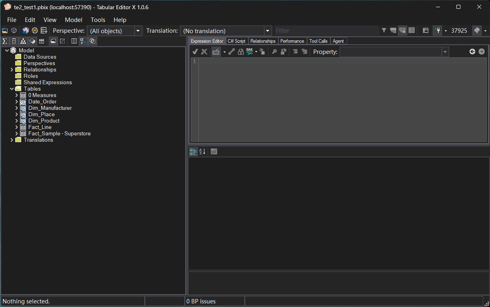
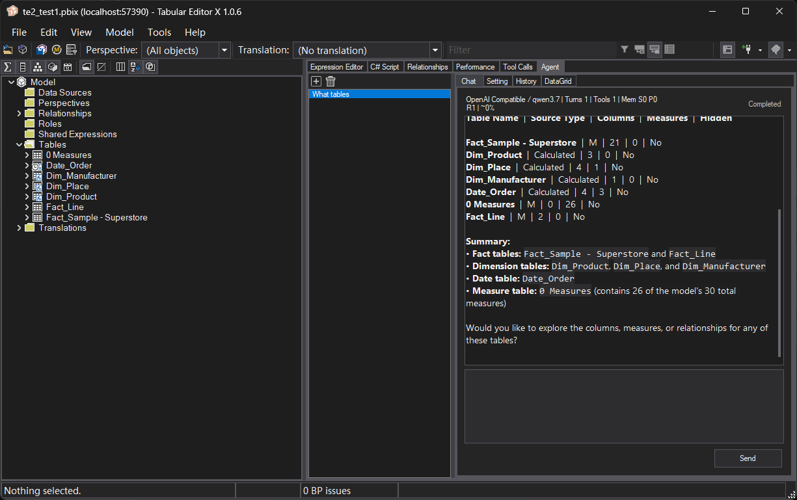
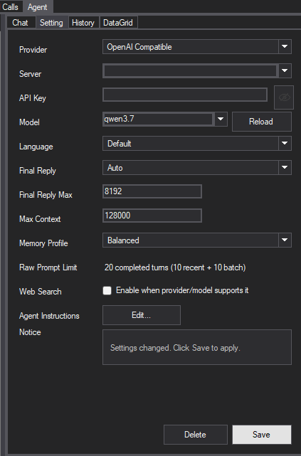
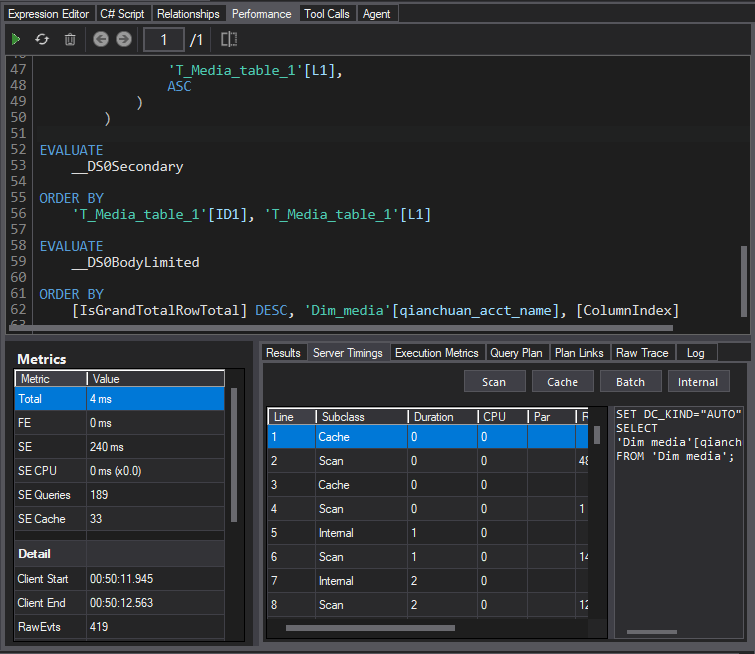
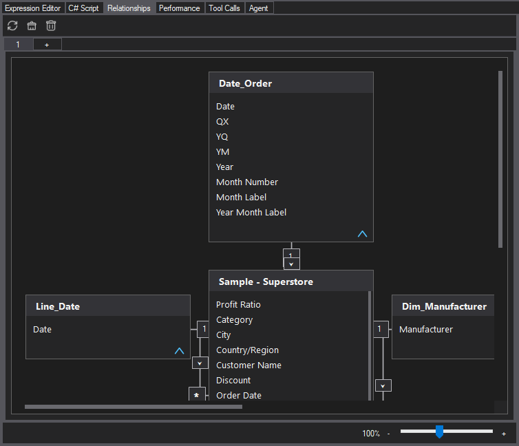
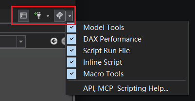

# Tabular Editor X

<p align="center">
  <picture>
    <source media="(prefers-color-scheme: dark)" srcset="readme-pic/TabularEditorX-white.png">
    
  </picture>
</p>

Tabular Editor X (TEX) is a Windows desktop editor for Power BI, Azure Analysis Services, and SQL Server Analysis Services tabular models. It continues from the open-source Tabular Editor 2 codebase and adds an embedded AI agent, local API and MCP automation, DAX performance analysis, semantic DAX IntelliSense, dependency and relationship canvases, persistent Macros, and an independent WiX installer.

Tabular Editor X is an independently maintained derivative project. It is not an official Tabular Editor 2 or Tabular Editor 3 release. Its executable, installer identity, user-data folders, and Power BI External Tools manifest are separate, so it can coexist with the original Tabular Editor 2.



## Highlights

- Edit tables, columns, measures, hierarchies, relationships, partitions, roles, perspectives, translations, and other tabular model objects.
- Write DAX with formatting, semantic IntelliSense, function help, and expression dependency analysis.
- Run C# scripts and persistent Macros, use the Best Practice Analyzer, and deploy models.
- Work with an embedded AI agent that supports tool calling, configurable providers, conversation memory, and controlled model operations.
- Expose model, DAX, Macro, and script-testing capabilities through a localhost API and a stable MCP bridge.
- Run DAX queries and inspect results, Server Timings, execution metrics, query plans, plan links, and raw traces.
- Explore models through Dependency Canvas and Relationship Canvas.
- Install independently through WiX MSI and register TEX as a Power BI Desktop External Tool.

## Screenshots

### DAX editing and IntelliSense


#### DAX IntelliSense and shortcuts

Native DAX IntelliSense provides suggestions for DAX functions, tables, columns, measures, and variables. It is available in the Expression Editor and the Performance DAX Query input when Native DAX IntelliSense is enabled.

##### Completion popup

| Shortcut | Action |
|---|---|
| `Ctrl + Space` | Force the suggestion popup to open. |
| `Up` | Select the previous candidate. |
| `Down` | Select the next candidate. |
| `Tab` | Accept the selected candidate. |
| Mouse click | Accept the clicked candidate. |
| `Esc` | Close the popup. |
| `Enter` | Close the popup without accepting its selected candidate. |

##### Documentation and definitions

| Shortcut | Action |
|---|---|
| `F12` | Go to a definition or documentation target for the token at the caret. |
| `Ctrl + Click` | Navigate variables or objects locally when possible; for a DAX function, open Microsoft DAX documentation. |
| `Alt + Click` | Open dax.guide for a DAX function. |

After a local navigation, use the mouse Back and Forward buttons or `Ctrl + Left Arrow` and `Ctrl + Right Arrow` to move backward or forward through the navigation history.

##### Comments

| Shortcut | Action |
|---|---|
| `Ctrl + /` | Toggle line comments for the current line or selection. |
| `Ctrl + '` | Toggle a block comment for the current selection. |

##### Advanced input

After an appropriate table or column reference, typing `?` can expand distinct values into a SWITCH-oriented editing pattern when the current model context supports it.

Suggestion metadata is refreshed for the active model. Switching models must not reuse stale tables, columns, or measures from the previous model.

### Embedded Agent





### DAX performance analysis



### Relationship Canvas



### Tool access and model utilities




## Download

Download the latest installer or portable package from [GitHub Releases](https://github.com/jasonlaw997/TabularEditorX/releases).

The release binaries are currently unsigned. Windows may show a Microsoft Defender SmartScreen warning. Verify downloaded files against the release's `SHA256SUMS.txt` before running them.

Each binary release also provides `FastColoredTextBox-2.16.24-tex-source.zip`, the corresponding source for the modified LGPL component included with TEX. This archive contains third-party component source only; the Tabular Editor X application source is not part of this binary-distribution repository.

## Requirements

- 64-bit Windows 10 or Windows 11.
- Microsoft .NET Framework 4.8 or later.
- Power BI Desktop, Azure Analysis Services, SQL Server Analysis Services Tabular, or a supported local tabular model file.

Windows 10 uses the fixed Dark top-bar behavior. Windows 11 supports the complete TEX theme selection.

## MSI installation

The x86-labelled MSI installs the 32-bit Windows desktop application and its required files. It also writes the Power BI External Tools manifest to:

```text
C:\Program Files (x86)\Common Files\Microsoft Shared\Power BI Desktop\External Tools\tabulareditorx.pbitool.json
```

Fully close and reopen Power BI Desktop after installation or upgrade so it reloads the External Tools manifest and icon.

## Portable use

Extract the complete `TabularEditorX-<version>-portable.zip` archive and run `TabularEditorX.exe` from the extracted directory. Keep all accompanying DLLs, configuration files, and the `runtimes` directory together with the executable.

The portable package does not install TEX, create shortcuts, or automatically register a Power BI External Tools manifest. Use the MSI when that registration is required.

## MCP integration

TEX includes a stable stdio-to-named-pipe MCP bridge. The stable MCP server key is `tex-mcp`; public MCP tool names use the `tex_` prefix only. Legacy `te2_` aliases are not exposed.

An external MCP client can launch the bridge with the TEX executable:

```json
{
  "mcpServers": {
    "tex-mcp": {
      "command": "C:\\path\\to\\TabularEditorX.exe",
      "args": ["--mcp-bridge", "--auto-or-select"]
    }
  }
}
```

Start the TEX desktop application and load or connect to a model before using model-dependent tools. The MCP menu in TEX controls which optional tool groups are exposed.

### Exposed tool surface

| Group | Public tools | Purpose |
|---|---|---|
| Instance and health | `tex_status`, `tex_current_instance`, `tex_list_instances`, `tex_select_instance`, `tex_clear_instance_selection`, `tex_mcp_self_check` | Discover and select a live TEX window, inspect model readiness, and validate the bridge. |
| Model tools | `tex_model_context`, `tex_model_*` | Inspect model metadata and perform catalog-defined model operations, including supported create, update, rename, delete, source-edit, save-status, and explicit save workflows. |
| DAX tools | `tex_dax_query`, `tex_dax_performance_run`, `tex_dax_performance_run_summary`, `tex_dax_history`, `tex_dax_current`, `tex_dax_compare`, and other published `tex_dax_*` tools | Execute read-only DAX queries and inspect performance runs, timings, plans, and comparisons. |
| Persistent Macros | `tex_macro_contexts`, `tex_macro_list`, `tex_macro_get`, `tex_macro_create`, `tex_macro_update`, `tex_macro_delete`, `tex_macro_run` | Manage and execute user Macros stored by TEX. Macro execution requires the global **Macro Tools** switch. |
| Script testing | `tex_script_load_file`, `tex_script_run_file`, `tex_script_run_text` | Load or run explicit C# test scripts when the corresponding Script Run File or Inline Script feature is enabled. |

The exact dynamic `tex_model_*` and `tex_dax_*` schemas are published by the active TEX instance through MCP `tools/list`. Mutating model tools and Macro operations default to `dry_run`; use `mode: "apply"` only for an explicitly requested change. Applying an in-memory model change does not save the model. Saving is a separate, explicit operation.

Persistent Macro C# is not sandboxed. Enabling **Macro Tools** allows eligible persistent Macros to be executed through API/MCP, subject to the Macro context and enabled-expression checks.

## Codex skill

The public repository includes the [`tex-mcp-modeling`](https://github.com/jasonlaw997/TabularEditorX/tree/main/tex-mcp-modeling) Codex skill. It documents instance selection, model and DAX operations, persistent Macro workflows, `dry_run`/`apply` safety, and the explicit model-save boundary for the stable `tex-mcp` server.

To install it as a user skill, copy the complete `tex-mcp-modeling` directory to your Codex skills directory. Keep its `agents` subdirectory together with `SKILL.md`.

## Local API

TEX also exposes a localhost API for controlled automation. Its feature menu can independently expose Model Tools, DAX Performance, file-based scripts, inline scripts, and Macro Tools. The assigned localhost port is shown in the TEX toolbar. The built-in **Help > API, MCP & Scripting** guide contains endpoint and parameter examples.

Local API and MCP access are intended for trusted automation on the current computer. Do not expose these endpoints to untrusted networks or callers.

## Data isolation

TEX stores application data separately from the original Tabular Editor 2:

```text
%LocalAppData%\TabularEditorX
%ProgramData%\TabularEditorX
```

Its policy registry path is:

```text
Software\Policies\Tabular Editor X Project\Tabular Editor X
```

TEX does not automatically migrate or overwrite `%LocalAppData%\TabularEditor`. A one-time in-application merge can import selected original Macro and BPA data while keeping TEX data authoritative and leaving the original files unchanged.

## Security boundaries

- Local automation interfaces are intended for trusted callers on the current computer.
- Model write, delete, rename, Macro execution, and save operations require the relevant feature gate and explicit authorization.
- `dry_run` validates or previews an operation without applying the model change.
- Never publish API keys, connection strings, access tokens, authentication caches, or sensitive model data in issues, logs, Agent conversations, or tool results.
- The embedded Agent, local API, and MCP share underlying capabilities while retaining separate transport, session, and authorization boundaries.

## License and origin

Modifications and additions made for Tabular Editor X are provided under the MIT License with Copyright (c) 2026 Tabular Editor X Project. Original Tabular Editor portions retain their applicable copyright notices, including Copyright (c) 2025 Tabular Editor ApS.

See [`LICENSE`](LICENSE), [`NOTICE.md`](NOTICE.md), [`THIRD-PARTY-NOTICES.md`](THIRD-PARTY-NOTICES.md), the bundled third-party license files, and the corresponding-source asset attached to each release for complete notices.

Tabular Editor X is an independently maintained derivative project and is not an official Tabular Editor ApS product. Tabular Editor, Tabular Editor 2, and Tabular Editor 3 names and trademarks belong to their respective owners.
